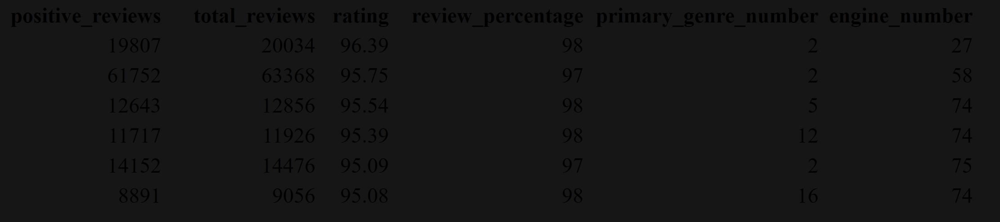

# CSCI 4555 Neural Networks and Machine Learning

## Final Project

### Collin B. & Max Q.

#### Project Learning Outcome

-   Students will be able to design, implement, and train a simple neural network for a given problem and justify their design and parameter choices.

#### Data

-   We will be using steam game data to estimate game ratings
-   Data set can be found [HERE](https://www.kaggle.com/datasets/whigmalwhim/steam-releases/data?select=game_data_all.csv)

#### How to run the project
-   Recommend to download the NeuralNetwork.rmd file and the steamGameData.csv from [HERE](https://www.kaggle.com/datasets/whigmalwhim/steam-releases/data?select=game_data_all.csv).
Ensure all the packages at the top of the rmd file are installed. Then you should be able to run or knit.

#### What data was used and what the model is trying to predict
-   We use the steam game data and tried to predict the rating(which is rated from 1- 100) for a specific game. 

#### Features used and their encoding
-   We have 3 Neural Networks
    - NN 1 uses positive reviews(numeric), total reviews review(numeric), percentage(numeric) 
    - NN 2 and 3 uses all of NN 1 data and engine type(categorical one hot encoding) and primary genre(categorical one hot encoding) and in NN 3 we normalized all the numeric columns used using L1 norm.

#### The architecture of the model (number of layers and nodes, functions used, etc.)
-   NN 1: Input layer is 64 nodes with 3 inputs and activation function of ReLU, one hidden layer of 64 nodes using sigmoid activation, one output node with linear activation.
-   NNs 2 & 3: Input layer is 256 nodes with 112 inputs and activation function of ReLU, one hidden layer of 64 nodes using sigmoid activation, one output node with linear activation.
-   The loss function for all of the NNs is MSE and our accuracy function is MAE

___

#### Project Work Write Up

##### Description of Design Matrix
- To obtain the data and run it...
    - Recommend to download the NeuralNetwork.rmd file and the steamGameData.csv from [HERE](https://www.kaggle.com/datasets/whigmalwhim/steam-releases/data?select=game_data_all.csv).
    - Ensure all the packages at the top of the rmd file are installed. then you should be able to run the code chunks or knit to a HTML document.

- Pre-processing
    - We removed a lot of columns because they wouldn't be useful.
    - We omitted any rows that had NA.
    - We extracted the game engine by using regex on the detected technologies column to extract just the engine used. Similarly, the primary genre was extracted using regex on the primary genre column.
    - We created columns where each unique engine and primary genre would have its own categorical numerical value.
    - One hot encoded categorical numerical values for primary genre and engine. 
- In the end, primary genre, engine, positive reviews, total reviews, negative reviews, rating, and review percentage are the features that are kept and used by the NNs. 
- There are 36711 total rows/observation in the data set after pre-processing.   

##### Our Goal and Hypothesis
- Goal
    - Accurately predict the rating of a steam game on a scale from 0-100.
- Hypothesis
    - Predicting the rating of steam games won't be difficult because rating is heavily influenced by total number of reviews and the percentage of reviews, and as long as at least this two features were used, it is fairly likely to create a strong model. 

##### Methods
- System Used
    - We used the keras package in R.
- Type of Neural Network
    - We create three feed forward neural networks all for a regression task. Feed forward neural networks are useful for feature learning which lends itself nicely for regression tasks. They are also flexible in what activation functions can be used, allowing for a more tailored model for each problem. 

##### Description of your training process

- Training/Testing Split
    - We did a random 75-25 split with no validation data. The data for rating is likely to be fairly normally distributed because really bad ratings should be as common as really high ratings, meaning a random split should not hinder the results.

##### Description of your process: 
- Begining of model creation
    - We first created a simple linear model for comparison purposes that used all the features. Our first Neural Network attempt had total reviews, positive reviews, and review percentage as features. We had an input layer with 64 nodes, 3 inputs and ReLU as the activation function. There is one hidden layer with 64 nodes using the sigmoid activation function. Lastly, there is one output node with linear activation. Using that structure we saw great success with an impressively high R squared value. The activation functions we choose worked very well. ReLU was a good choice for input for its efficiency and defectiveness, the data also had no negative values, so that was not a concern. Sigmoid worked well because we are predicting a rating score that ranges from 0-100 and sigmoid ranges from 0-1, so scaling that up a final prediction would be simple. Linear activation for the output is a good chocie because this is a regression based task. We tried tanh for the hidden layer and it worked but it wasn't as efficient as sigmoid, so we stuck with sigmoid.
- Evolving our model
    - For our second attempt we used all the same features as the first neural network, but added the game engine (categorical one hot encoded) and primary genre(categorical one hot encoded). We increased the number of nodes of the input layer to 256 to handle the 112 inputs that we now had due to the one-hot encoded features. The rest of the structure remained the exact same as the first neural network. The increase in nodes for the input layer seemed to better handle the increased number of inputs. 
    - For the third attempt, we kept everything the same as the second neural network, but we normalized the all the numeric features using L1 norm. We choose L1 norm because it is robust against outliers. We chose this because there are lots of games that have many reviews and other games with only a few reviews, and normalizing the data could help the neural network train more efficiently. 

##### Results
We used MAE for the measure of accuracy because it's a regression model and R squared to see how well the model explained the data in a percentage. The loss metric we used was MSE which is the common function for a regression model.

- Neural Network one 
    - Loss = 2.5087 (test)
    - MAE = 1.17 (test)
    - R2 = 99.7% (train)

- Neural Network two
    - Loss = 0.6172 (test)
    - MAE = 0.54 (test)
    - R2 = 99.6% (train)

- Neural Network three
    - Loss* = 6.47 x 10-5 (test)
    - MAE* = 0.0057 (test)
    - R2 = 99.8% (train)
    - \* (loss and MAE not comparable due to normalization)

##### Conclusion
Predicting the rating isn't that difficult and can be done pretty easily using a simple model as shown in Neural Network 1. The results of all three models show that game rating can be predicted very accurately, showing that this is a task the a neural network can effectively learn. 

##### Challenges and ideas for improvement
One challenge we faced was getting the engine and genre data to look the way we wanted. We had to experiment with different regex formulas to eventually get it to look right. There aren't many ways to really improve the prediction of rating given the results we saw, but it could be more interesting to predict a different metric that is not present in the data set. For example, it would be cool to try to predict average playtime on a given game given the rating and other features. 
